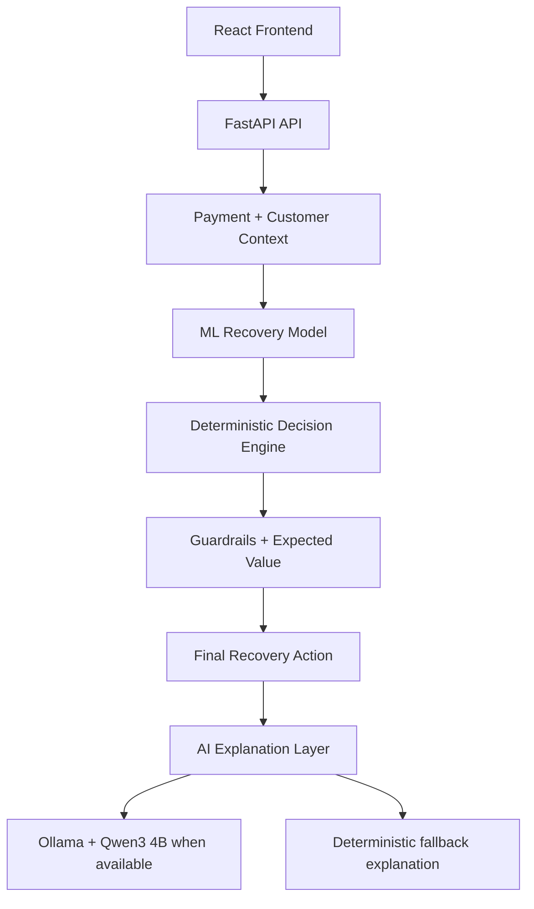

# Adaptive Payment Recovery

An AI-powered payment recovery decision engine that predicts recovery probability for each candidate action, applies deterministic guardrails, and selects the eligible action with the highest incremental expected value.

**Core principle:** ML predicts -> Guardrails constrain -> Economics decides -> AI explains.

---

## Live Demo and Repository
- Frontend: https://adaptive-payment-recovery-1.onrender.com
- GitHub: https://github.com/Sarthak0205/adaptive-payment-recovery

Verified demo cases:
- PAY_000001 -> Payment Link
- PAY_000002 -> Retry Later
- PAY_000008 -> Payment Link
- PAY_000016 -> No Action
---

## Problem

Failed payments need more than a raw probability score. A recovery action can be likely to work but still be a poor choice if it is blocked by business rules or creates low economic value.

This project addresses that gap by separating prediction from decisioning.

---

## Solution

The system evaluates five candidate actions:

1. Retry Now
2. Retry Later
3. Payment Link
4. Change Payment Method
5. No Action

The workflow is:

1. Load the payment row and customer context.
2. Score all five actions with the ML model.
3. Apply deterministic guardrails.
4. Compute incremental recovery and incremental expected value.
5. Select the best eligible action.
6. Generate an explanation with Qwen3 4B when Ollama is available, otherwise use a deterministic fallback.

---

## How It Works

For each action, the ML model estimates recovery probability from the payment features and the candidate recovery action.

The decision engine uses the no-action probability as the baseline and computes:

$$
\text{incremental recovery}
=
\text{action probability}
-
\text{no-action baseline}
$$

$$
\text{incremental expected value}
=
\text{incremental recovery}
\times
\text{payment amount}
-
\text{action cost}
$$
The current implementation also filters intervention actions using a minimum recovery probability threshold of 0.30 before selecting the best eligible option.

The important distinction is:

- Raw ML probability tells you how likely an action is to recover the payment.
- The decision engine tells you whether that action is eligible and economically worthwhile.

---

## Architecture



The backend is authoritative for the final decision. The LLM only explains the decision and does not override it.

---

## Decision Logic

The decision engine is deterministic:

1. Generate recovery probabilities for all five actions.
2. Use `no_action` as the baseline.
3. Compute incremental recovery and incremental expected value.
4. Apply guardrails.
5. Keep only eligible intervention actions.
6. Select the eligible action with the highest incremental expected value.
7. If no intervention remains, return No Action.

The decision output includes the recommended action, recovery probability, baseline probability, incremental recovery, incremental expected value, action cost, and guardrail evidence.

---

## Guardrails

The implementation currently enforces two hard constraints:

- `attempt_number >= 3` blocks `Retry Now` and `Retry Later`
- `failure_reason == blocked_card` blocks `Retry Now` and `Retry Later`

These rules preserve the raw ML predictions, but remove ineligible retry actions from the final choice set.

---

## Machine Learning

The model is a Scikit-learn pipeline:

```text
Categorical features -> OneHotEncoder
Numerical features   -> StandardScaler
Both streams         -> Logistic Regression
```

### Features

- amount
- payment_method
- failure_reason
- bank
- previous_successes
- previous_failures
- attempt_number
- customer_age_days
- hour
- day_of_week
- recovery_action

### Dataset

- Source: synthetic payment recovery CSV
- Size: 20,000 transactions
- Split: 80% training, 20% test

### Model Metrics

These metrics are from the synthetic dataset and are not production performance.

| Metric | Score |
| --- | ---: |
| Accuracy | 65.70% |
| Precision | 61.93% |
| Recall | 61.93% |
| F1 | 61.93% |
| ROC-AUC | 72.41% |

---

## AI Explanation Layer

The explanation layer uses Qwen3 4B through Ollama when a local Ollama server is available.

The application sends structured evidence to the model:

- payment facts
- customer history
- failure analysis
- ML predictions
- decision-engine output

If Ollama is unavailable, the backend returns a deterministic evidence-based explanation. This means the deployed backend does not depend on a local Ollama server.

---

## Demo Scenarios

### PAY_000001 -> Payment Link

- Amount: ₹2,690.20
- Attempt number: 4
- Retry actions are blocked by the attempt threshold
- Decision: Payment Link
- Baseline probability: 36.07%
- Incremental expected value: ₹673.60

### PAY_000002 -> Retry Later

- Amount: ₹1,618.72
- Attempt number: 2
- Retry actions remain eligible
- Decision: Retry Later
- Incremental expected value: ₹424.41

### PAY_000008 -> Payment Link

- Amount: ₹3,340.74
- Attempt number: 3
- Retry Later has the highest raw ML probability at 41.86%
- Retry actions are blocked by the attempt-number guardrail
- Payment Link has a recovery probability of 39.50%
- Baseline probability is 18.97%
- Incremental recovery is 20.53%
- Incremental expected value is ₹684.95
- Final decision: Payment Link

This case shows the core behavior of the system: the highest raw probability is not the final decision when a retry action is ineligible.

### PAY_000016 -> No Action

- Amount: ₹1,153.05
- Failure reason: blocked_card
- Attempt number: 4
- Retry actions are blocked by the guardrails
- Decision: No Action
- Incremental recovery: 0%
- Incremental expected value: ₹0.00

---

## Tech Stack

- Backend: Python, FastAPI, Uvicorn, Pydantic
- Machine learning: Scikit-learn, Pandas, NumPy, Joblib
- Explanation: Ollama, Qwen3 4B
- Frontend: React, Vite, Lucide React
- Data source: CSV
- Deployment: Render static site and Render web service

---

## Project Structure

```text
adaptive-payment-recovery/
├── api/
│   └── main.py
├── app/
│   ├── agent.py
│   ├── llm_agent.py
│   ├── llm_tools.py
│   └── tools.py
├── data/
│   └── payment_recovery_data.csv
├── frontend/
│   ├── index.html
│   ├── package.json
│   ├── vite.config.js
│   └── src/
├── models/
│   └── recovery_model.pkl
├── notebooks/
├── src/
│   ├── analyze_data.py
│   ├── decision_engine.py
│   ├── generate_data.py
│   └── train_model.py
├── requirements.txt
└── README.md
```

---

## Local Setup

### Backend

```bash
python3 -m venv .venv
source .venv/bin/activate
pip install -r requirements.txt
uvicorn api.main:app --reload
```

### Frontend

```bash
cd frontend
npm install
npm run dev
```

### Optional Ollama Setup

```bash
ollama pull qwen3:4b
ollama run qwen3:4b
```

---

## API

### `GET /`

Returns a simple service status payload.

### `GET /health`

Returns `{"status": "healthy"}`.

### `POST /recover`

Request body:

```json
{
  "payment_id": "PAY_000008"
}
```

The response includes:

- payment
- customer_history
- failure_analysis
- predictions
- decision
- analysis

If the payment ID is not found, the API returns 404.

---

## Deployment

- Frontend: Render Static Site
- Backend: Render Web Service
- Production frontend URL: https://adaptive-payment-recovery-1.onrender.com
- The frontend uses `VITE_API_URL` to point at the production backend
- Production backend URL: https://adaptive-payment-recovery.onrender.com
The public deployment has been manually verified end to end.

---

## Limitations

- The training data is synthetic.
- The current prototype uses CSV as its data source.
- Model probabilities are not causal estimates.
- The model has not been validated on real payment data.
- There is no real payment gateway execution.
- There is no production authentication or production monitoring stack.
- Real recovery-outcome tracking is not present because the prototype uses synthetic payment data.
- Ollama is optional for explanations; the backend falls back to deterministic output when it is unavailable.

---

## Conclusion

Adaptive Payment Recovery separates prediction, guardrails, economics, and explanation. That separation is the main value of the project: the model estimates recovery likelihood, the decision engine enforces business constraints, and the final action is selected by incremental value rather than raw probability alone.
